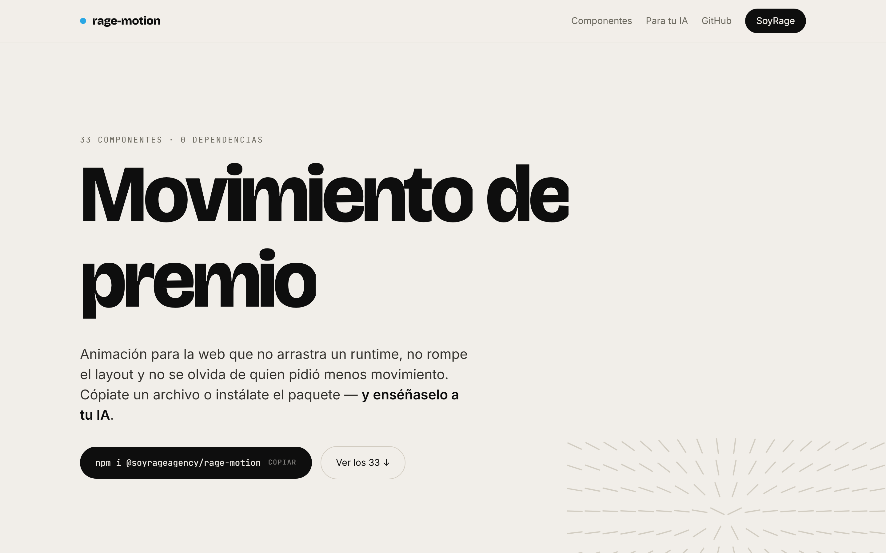

<div align="center">

# rage-motion

**Movimiento de premio para la web. Sin dependencias, hoy y siempre.**

[](https://www.npmjs.com/package/@soyrageagency/rage-motion)
[](./mcp)
[](./package.json)
[](./LICENSE)

33 componentes de animación — scroll reveals, texto que se parte, cursor
magnético, transiciones de página, fondos generativos — en archivos sueltos que
puedes copiar uno a uno.

**[Ver la demo en vivo →](https://soyrageagency.github.io/rage-motion/)**

Hecho por [SoyRage Agency](https://soyrage.es/)



</div>

---

## Por qué otro kit de animación

Casi toda la animación web está rota de la misma forma: un `opacity: 0` en el
CSS y un *listener* de scroll por elemento.

```css
.fade { opacity: 0; }          /* el día que el JS no carga, la página sale en blanco */
```

```js
window.addEventListener("scroll", () => {          /* una lectura de layout por */
  document.querySelectorAll(".fade").forEach(…);   /* elemento y por evento     */
});
```

Aquí no:

| | |
| --- | --- |
| **Se ve aunque falle** | El estado inicial lo pone JavaScript, nunca el CSS. Si el script no carga, la página se ve — sin animar, pero se ve. |
| **No mueve el layout** | Sólo `transform` y `opacity`. Ningún efecto puede provocar un salto de contenido. |
| **Una lectura por fotograma** | Todos los efectos de scroll comparten un único `rAF` y una única lectura de posición, los usen cuatro componentes o veinte. |
| **`prefers-reduced-motion` de verdad** | Cada componente salta a su estado final. Nunca se resuelve escondiendo lo que había que animar. |
| **Accesible por defecto** | El texto partido conserva su nombre accesible y el copiar-pegar; el *slider* de antes/después funciona con teclado. |
| **Cero dependencias** | Web Animations API, IntersectionObserver, CSS. Nada más, y nada nuevo en el futuro. |

## Instalación

```bash
npm i @soyrageagency/rage-motion
```

```js
import { init } from "@soyrageagency/rage-motion";
import "@soyrageagency/rage-motion/css";

init();   // arranca todo lo que va por atributos en el markup
```

Sin *build*, desde un CDN o desde tu carpeta:

```html
<link rel="stylesheet" href="/vendor/rage-motion.css">
<script type="module">
  import { init } from "/vendor/rage-motion/index.js";
  init();
</script>
```

**O cópiate un archivo.** Cada componente depende sólo de `src/core/motion.js`.
Llévate los dos y ya está — es como lo va a usar casi todo el mundo, y está
pensado exactamente para eso.

## Uso

Casi todo se activa desde el markup, sin escribir JavaScript:

```html
<div data-rm-reveal="up" data-rm-delay="120">Aparece al hacer scroll</div>

<h1 data-rm-text="chars" data-rm-effect="rise">Se parte letra a letra</h1>

<span data-rm-type="Diseño|Desarrollo|Motion"></span>

<article data-rm-tilt="8" data-rm-spotlight>Se inclina y se ilumina</article>

<div data-rm-marquee data-rm-speed="80">
  <span>Nunca da el salto</span>
</div>
```

Y cuando quieras control, cada componente es una función que devuelve su propio
`stop`:

```js
import { cursor, parallax, pageTransition } from "@soyrageagency/rage-motion";

const stop = cursor({ blend: "difference" });
parallax("[data-rm-parallax]", { speed: 0.22 });
pageTransition({ duration: 520 });

stop();   // lo deja todo como estaba
```

## Los 33 componentes

**Entradas** · `reveal`

**Texto** · `textReveal` · `decrypt` · `glitch` · `shiny` · `countUp` · `split`

**Vitrina** · `typewriter` · `waveText` · `magnetLines` · `ripple`

**Cursor** · `cursor` · `splash` · `magnetic`

**Tarjetas** · `spotlight` · `tilt` · `border`

**Fondos** · `aurora` · `particles` · `grain`

**Scroll** · `parallax` · `progress` · `horizontal` · `stack` · `scrub`

**Media** · `imageReveal` · `pixelate` · `hoverPreview` · `marquee`

**Interacción** · `compare` · `panels` · `skew` · `orbit`

**Páginas** · `pageTransition` · `transitionTo`

Todos, funcionando y con su markup listo para copiar, en la
**[demo](https://soyrageagency.github.io/rage-motion/)**.

## Enséñaselos a tu IA

Le pides a cualquier asistente «un scroll reveal» y te escribe el recorte de
siempre, porque no sabe qué tienes en el proyecto. El
**[servidor MCP](./mcp)** le da los componentes de verdad: el código, el markup,
las opciones y los tokens de diseño.

```bash
claude mcp add rage-motion -- npx -y @soyrageagency/rage-motion-mcp
```

A partir de ahí, cuando le pidas una animación mira antes de escribir, usa
`data-rm-reveal` en vez de inventarse un *listener*, y te explica por qué eligió
lo que eligió — porque el razonamiento viaja con cada componente.

Sin claves, sin cuenta, sin red: el servidor sólo lee archivos del paquete
instalado. [Cómo se instala en Cursor, Claude Desktop y VS Code →](./mcp)

## Los tokens

La paleta por defecto es la de SoyRage, y todo son *custom properties*:
cambia `--rm-accent` y se retematiza el kit entero.

```css
:root {
  --rm-ink: #0e0e0e;      --rm-cream: #f1eee9;    --rm-muted: #6c695f;
  --rm-accent: #2aa7e4;   --rm-terracotta: #d28c65; --rm-yellow: #f4d738;

  --rm-radius-sm: 4px;    --rm-radius: 24px;      --rm-radius-lg: 36px;
  --rm-ease-out: cubic-bezier(0.22, 1, 0.36, 1);
}
```

## Desarrollo

```bash
npm install
npm run demo         # la demo en http://localhost:4321
npm test             # tests unitarios
npm run test:mcp     # el servidor MCP, hablando el protocolo de verdad
npm run check        # la demo en un navegador real, con y sin reduced motion
npm run check:dist   # lo mismo, contra lo que se publica
npm run assets       # regenera las imágenes
```

`npm run check` es el que importa: carga la página en Chromium, falla ante
cualquier error de consola, y comprueba que después de recorrer toda la página
no queda nada invisible — ni con `prefers-reduced-motion` activado.

## Roadmap

Lo que viene, y lo que no, en **[ROADMAP.md](./ROADMAP.md)**.

## Licencia

MIT. Llévatelo, cámbialo, véndelo. Si te sirve, un ⭐ ayuda más de lo que parece.

---

<div align="center">

Hecho por **[SoyRage Agency](https://soyrage.es/)** — diseño, desarrollo y motion.

¿Necesitas una web que se mueva así? **[soyrage.es](https://soyrage.es/)**

</div>
