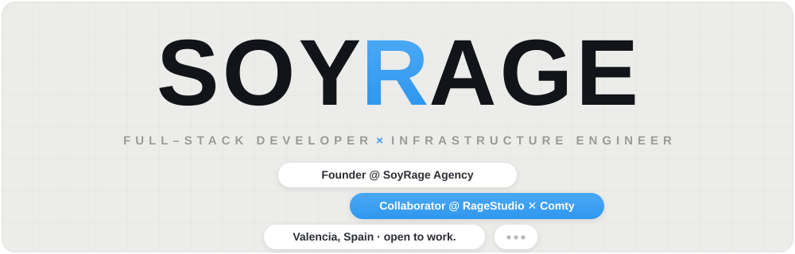

# Roadmap

**What is coming, in the order it will arrive. And at the end, what will never arrive — which in an animation library matters just as much.**

Dates are intentions, not promises. If you need something sooner,
[open an issue](https://github.com/soyrageagency/rage-motion/issues) and it moves up.

---

## 0.1 — Shipped

- [x] **134 components** across twenty-nine modules, each standalone and
      copyable — plus 50 named scroll entrances on `reveal`, 52 named looks on
      `buttonKit` and 24 on `cardKit`, which are variants of one component
      rather than a hundred more files to keep correct.
- [x] **Forms that stay forms** — every one decorates the real control and
      keeps its name, its value, the tab order and the browser's own
      validation. Plus the two with a personality: a face that covers its eyes
      while you type your password, and a padlock that opens or slams.
- [x] `core/motion.js`: motion preference, easings, one shared `rAF`, one shared
      scroll read, and an `animate()` that jumps to the finished state instead
      of skipping the animation.
- [x] Text splitting that keeps the accessible name, copy-paste and line breaks.
- [x] **Typography with technique** — variable-font `pressure`, `morph` with a
      real FLIP between shared letters, `curve` on a genuine `textPath`,
      `odometer` digit columns.
- [x] **Carousels that work** — `carousel` on native scrolling with momentum,
      `ring` with drag inertia and arrow keys, `deck` that keeps card identity.
- [x] **Navigation that does not break the site** — `pill`, `gooey`,
      `condense`, `tabs` on the real tab pattern, and an `overlay` that traps
      focus, closes on Escape, restores focus and marks the page inert.
- [x] **Buttons that decorate rather than replace** — direction-aware `fill`
      and `underline`, `shimmer`, `spark`, `swap`, `press`, `halo`,
      `strokeDraw`.
- [x] **Chrome that is styled, not rebuilt** — five scrollbars that are still
      scrollbars, a dropdown on the real menu pattern, an announced tooltip,
      and a switch that is a checkbox underneath.
- [x] MCP server: `list_components`, `get_component`, `get_tokens`,
      `get_stylesheet`, `about`, plus a prompt and a resource.
- [x] A public demo that doubles as the documentation.
- [x] `npm run check`: the demo in real Chromium, with and without reduced
      motion, driving the menu by keyboard, failing on any console error or
      anything left invisible on screen.

## 0.2 — Finer control *(next)*

- [ ] **Per-element `data-rm-once="false"`.** `data-rm-loop` covers repeating
      while an element is on screen; replaying on re-entry is still a set-wide
      option rather than a per-element one.
- [ ] **Every option available as `data-rm-*`.** Markup should be able to
      configure whatever JavaScript can, across all components rather than some.
- [ ] **Types.** `.d.ts` generated from the JSDoc that is already written.
- [ ] **Scene presets** — tested combinations (hero, project index, pricing)
      behind a single attribute.

## 0.3 — Performance you can see

- [ ] **A motion budget.** A console warning when a page starts more components
      than it can hold at 60fps, naming the expensive ones.
- [ ] **Native scroll timelines everywhere they fit.** `progress` already uses
      them; `parallax`, `scrub`, `stack` and `flatten` can.
- [ ] **Load what the page uses.** An `init()` that imports only the modules
      whose attributes actually appear in the document.

## 0.4 — Reach

- [ ] **React, Vue and Svelte wrappers.** Separate packages: the core stays
      dependency-free and framework-free.
- [ ] **Template gallery.** Whole pages — studio, product, portfolio — to take
      outright.
- [ ] **More showpiece components**, driven by what people ask for in issues.

## Unscheduled, but on the list

- [ ] A short clip of every component in the README, generated from the demo.
- [ ] A debug mode that draws the trigger thresholds over the page.
- [ ] A Spanish translation of the docs and the demo.

---

## What will not happen

None of this is laziness. Each one would make the library worse.

- **Dependencies.** Not one. Not GSAP, not Lenis, not a 2 KB utility. The day
  this package has a non-empty `dependencies` it stops being what it is.
- **Smooth scrolling that replaces the browser's.** It breaks the scrollbar,
  find-in-page, the keyboard and half of accessibility. `skew()` gives you the
  part you can actually see — the lean — without touching scroll.
- **A blanket `* { animation: none !important }` for reduced motion.** It is
  the usual snippet and it leaves invisible every element whose visible state
  is the end of an animation. Each component handles the preference itself.
- **Animating layout properties.** No `top`, `left`, `width` or `margin`. If an
  effect needs them, the effect is wrong.
- **A smaller bundle at the cost of the comments.** The code explains why it
  does what it does. That is half the value when you copy a file into your
  project — and it is exactly what your AI reads over MCP.

---

Built by **[SoyRage Agency](https://soyrage.es/)** — design, development and motion.

**© 2026 SoyRage Agency — https://soyrage.es/**

